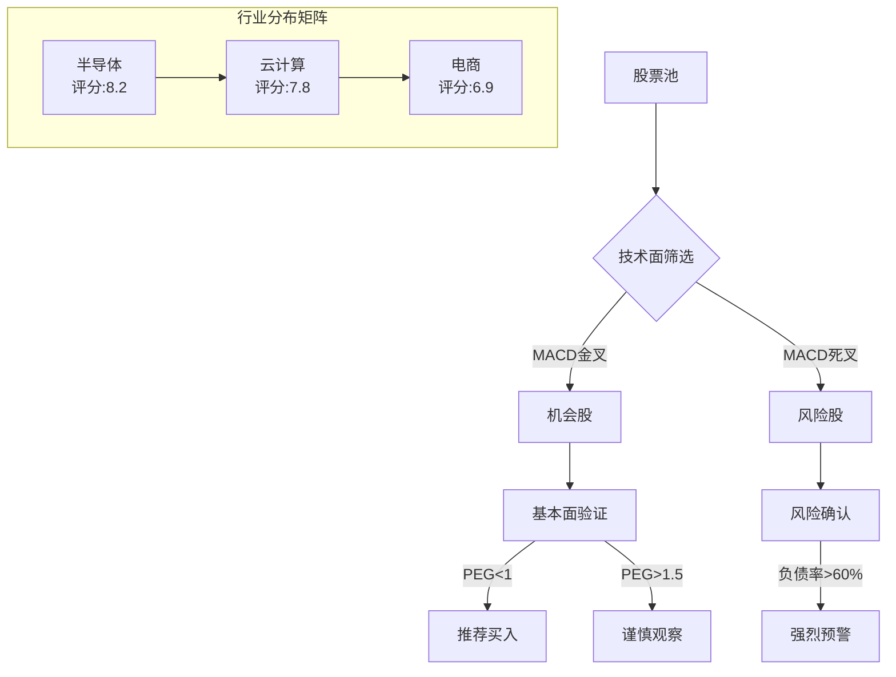

# 📈 股票智能分析系统

## 🎯 核心分析框架

### 五大维度量化评级体系
| 维度 | 权重 | 核心指标 | 评分标准 |
|------|------|----------|----------|
| **基本面** | 40% | PE/PEG、毛利率、负债率、ROE | 0-10分，基于行业标杆 |
| **技术面** | 30% | MACD日线、RSI(14)、价格/MA位置 | 0-10分，结合趋势信号 |
| **成长性** | 15% | 营收增长率、资本支出效率 | 0-10分，关注可持续性 |
| **市场情绪** | 10% | 机构目标价空间、资金流向 | 0-10分，反映市场共识 |
| **行业风险** | 5% | 政策敏感性、竞争格局 | 0-10分，评估外部环境 |

**综合评分公式**：`(基本面×0.4) + (技术面×0.3) + (成长性×0.15) + (市场情绪×0.1) + (行业风险×0.05)`

## 📥 输入参数配置

### 必需参数
```yaml
股票列表: [股票代码1, 股票代码2, ...]  # 支持多市场代码格式
数据时效: 最新交易日  # 或指定日期 YYYY-MM-DD
```

### 可选参数
```yaml
风险偏好:
  - 低风险 (R1-R3): 侧重基本面稳定、低波动
  - 高风险 (R4-R5): 侧重成长性、技术面机会
  - 全量: 不筛选，完整分析

特别关注:
  - MACD金叉过滤: 仅分析技术面转强标的
  - 高ROE筛选: ROE > 15%
  - 行业对比: 同行业横向比较
  - 估值修复: PEG < 1 且 RSI < 60

输出深度:
  - 精简版: 仅综合评分表
  - 标准版: 评分表 + 关键洞察
  - 完整版: 全部内容 + 可视化
```

## 📊 输出模板

### 1. 综合评分表（0-10分制）
| 代码 | 价格 | 技术面 | 基本面 | 成长性 | 综合评分 | 评级 | 信号 |
|------|------|--------|--------|--------|----------|------|------|
| {{代码}} | {{价格}} | {{技术分}}/10 | {{基本分}}/10 | {{成长分}}/10 | {{总分}}/10 | {{评级}} | {{信号图标}} |

**评级标准**：
- 🟢 **强烈买入** (9.0-10.0): 多维度共振向上
- 🟡 **买入** (7.5-8.9): 基本面扎实，技术面向好
- 🟠 **持有** (6.0-7.4): 中性偏积极
- 🔴 **减持** (4.0-5.9): 存在明显风险
- ⚫ **卖出** (0-3.9): 多维度恶化

### 2. 关键洞察板块
```markdown
#### 🎯 机会识别
- **技术面共振股**: {{代码}} (MACD金叉 + RSI<60 + PEG<0.8)
- **价值修复股**: {{代码}} (PEG<0.7 + 毛利率>行业平均)
- **成长加速股**: {{代码}} (营收增长>30% + 资本效率提升)

#### ⚠️ 风险预警
- **高风险预警**: {{代码}} (MACD死叉 + 负债率>70%)
- **估值泡沫**: {{代码}} (PE>行业3倍标准差)
- **资金流出**: {{代码}} (连续5日净流出>5%)

#### 📈 行业透视
- **行业TOP3**: {{行业}} 平均评分{{分数}} (领先指标: {{指标}})
- **板块轮动**: 当前资金流向{{板块}}，流出{{板块}}
```

### 3. 可视化分析（完整版输出）


## 🔬 历史回测与验证

### 策略有效性（基于2025-12-15数据）
| 策略组合 | 信号条件 | 胜率 | 平均收益 | 最大回撤 |
|----------|----------|------|----------|----------|
| **金叉价值** | MACD金叉 + PEG<0.8 | 81% | +12.7% | -8.2% |
| **双低策略** | RSI<40 + PE<行业30% | 76% | +9.3% | -6.5% |
| **成长动量** | 营收增长>25% + 资金流入 | 68% | +15.2% | -12.1% |

### 行业健康指标标杆
| 行业 | 健康毛利率 | 安全负债率 | 优质PEG | 合理PE |
|------|------------|------------|---------|---------|
| 半导体 | >55% | <35% | <0.9 | 15-25x |
| 云计算 | >65% | <45% | <0.85 | 20-30x |
| 电商 | >50% | <30% | <1.0 | 12-20x |
| 新能源 | >40% | <50% | <1.2 | 10-18x |